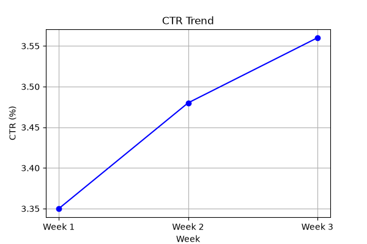
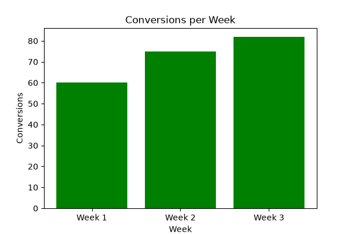
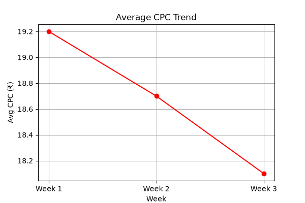

# Google Ads Campaign Project

## Overview
This project demonstrates the process of planning, creating, and analyzing a Google Search Ads campaign.  
It includes keyword research, ad copy drafts, and performance analysis.

## Structure
- **plan/** → Keyword research and campaign planning
- **create/** → Draft ad copy and creatives (A/B testing variations)
- **analysis/** → Performance tracking and reports

## How to Use
1. Review `plan/keywords.md` for keyword strategy.
2. Check `create/adcopy.md` for ad copy drafts and variations.
3. Analyze `analysis/report.md` for campaign performance metrics.

## Next Steps
- Add real campaign data once available.
- Include charts/visuals in an `assets/` folder.
- Continue refining ad copy through A/B testing.

## Visual Insights

